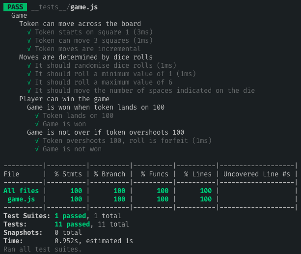

[](https://travis-ci.org/jonurry/snakes-and-ladders-kata)
[](https://codecov.io/gh/jonurry/snakes-and-ladders-kata)

# snakes-and-ladders-kata

Solution to the Snakes and Ladders Kata at [Agile Katas](http://agilekatas.co.uk/katas/SnakesAndLadders-Kata)

**Note:** Currently only implemented Feature 1 of 4 - _Moving Your Token_

## Approach

I knew that I wanted to test-drive my solution so following a `test-driven development` approach was essential. I used the `red, green, refactor` TDD approach where you write a failing test, implement code to pass the test and then refactor to keep the code clean and as simple as possible.

## Design Decisions

I chose to implement the solution in `JavaScript` using `Node`. I like JavaScript and it's one of the languages taught at Makers so it seemed like a natural fit. I chose `Jest` as the testing framework as it is really powerful and I like using it.

The structure of the code is very simple. The single source code file (`game.js`) is located in the `src` directory and the single test file (also `game.js`) is located in the `__tests__` directory. I saw no need for anything more complicated at this stage.

## Problems

I wanted to use the `ES6` features of JavaScript, such as `Classes` and `Modules`. This did cause a few issues as I had to install and configure a few node packages in order to transpile the code for `Jest` to understand the module syntax.

## The Future

I wanted to keep the solution simple and not worry about future features. This is why there's only one class in the project, the `Game` class. At this point in time, I saw no need to make it any more complicated than that. Once players are introduced I would expect the class model to expand to at least include a `Player` class.

## Installation

The project requires `Node.js` to be installed on your computer. If you don't have node installed you can download and install it by following the instructions located [here](https://nodejs.org/en/download/)

To get the project code, please enter the following command in the terminal:

```
git clone git@github.com:jonurry/snakes-and-ladders-kata.git
```

then, change to the newly created code directory:

```
cd snakes-and-ladders-kata
```

To install the project dependencies, please enter the following command in the terminal:

```
npm install
```

The project installs and uses the following dependencies:

- `jest` for running the tests

- `babel` for transpiling the ES6 JavaScript code to ES5 so that `node` and `jest` understands it

- `ESLint` for linting the code and making sure that it has a consistent syntax

- I also use `prettier` in the `VS Code` IDE to ensure consistent code formatting

## Tests

To run all of the tests with code coverage (only once), please enter the following command in the terminal:

```
npm test
```

To run the tests in watch mode:

```
npm run test:watch
```

Here's what to expect when you run the tests:


